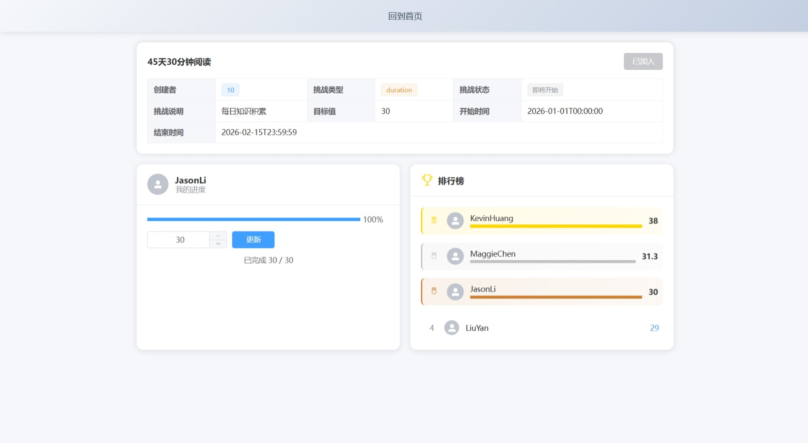
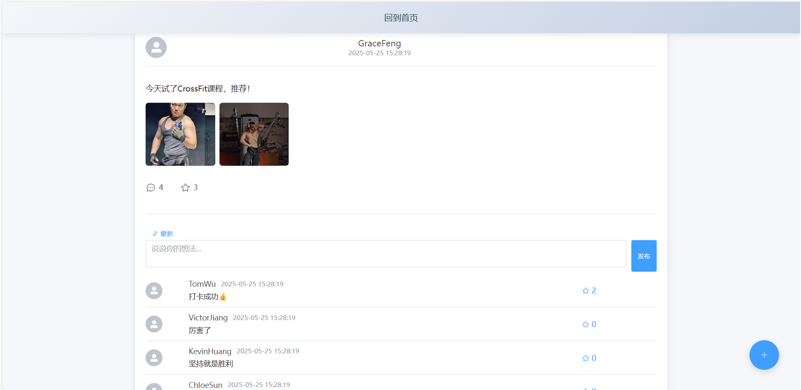

# 个人健康助手网站 - 用户使用手册

## 目录
1. [快速入门](#1-快速入门)
2. [功能介绍](#2-功能介绍)
    - [训练任务管理](#21-训练任务管理)
    - [健身预约排课](#22-健身预约排课)
    - [训练数据仪表板](#23-训练数据仪表板)
    - [线上竞赛](#24-线上竞赛)
    - [社交分享与排行榜](#25-社交分享与排行榜)
3. [常见问题](#3-常见问题)

---

## 1. 快速入门

### 1.1 注册与登录
1. 访问网站首页，点击 **“注册”** 按钮。
2. 填写邮箱、用户名和密码，完成注册。
3. 登录后，进入主页，即可开始使用所有功能。

### 1.2 首次使用建议
- 在 **“训练任务管理”** 中创建您的第一个训练计划。
- 通过 **“健身预约排课”** 预约一节课程或场地，体验便捷服务。
- 查看 **“训练数据仪表板”** 了解初始数据，设定健身目标。

---

## 2. 功能介绍

### 2.1 训练任务管理
**功能概述**：帮助用户创建、管理每日或每周训练任务，设定目标并追踪进展。

#### 如何使用
1. **创建任务**：
    - 点击 **“训练任务”** → **“新建任务”**。
    - 填写任务名称、类型（如跑步、瑜伽）、时长、目标（如消耗卡路里）。
    - 设置提醒时间（可选）。

2. **管理任务**：
    - 在任务列表中查看所有任务，支持按日期筛选。
    - 点击任务可编辑详情或标记为完成。

3. **追踪进展**：
    - 完成任务后，系统自动记录数据并更新至仪表板。

### 2.2 健身预约排课
**功能概述**：浏览健身房，预约健身课程，用户可根据自己偏好的时间进行选择。

#### 如何使用
1. **查找课程/场地**：
    - 进入 **“健身课程”** 页面，选择健身房或训练中心。
    - 查看场地可用时间。

2. **预约**：
    - 点击对应的健身房，查看健身房课程预约详情。
    - 选择合适的日期、课程，确认预约。
    - 支持取消或修改预约（需提前至少2小时）。

### 2.3 训练数据仪表板
**功能概述**：可视化展示训练数据，帮助用户追踪目标完成情况。

#### 关键指标
- **卡路里消耗**：每日/每周总计。
- **训练时长**：分类型统计（如有氧、力量）。
- **进步趋势**：通过折线图展示长期变化。

#### 如何使用
- 进入 **“仪表板”** 页面，默认显示最近7天数据。
- 点击图表可切换时间范围（如月视图）。

### 2.4 线上竞赛
**功能概述**：参与健身挑战，与其他用户竞争特定目标（如步数、卡路里）。

#### 如何使用
1. **加入竞赛**：
    - 在 **“线上竞赛”** 页面选择感兴趣的挑战（如“30天跑步挑战”）。
    - 点击对应挑战进入挑战页面。
    - 点击 **“加入挑战”** 即可成功加入。

2. **参与竞赛**：
    - 上传自己的训练数据。
    - 在竞赛页面查看实时排名。

### 2.5 社交分享与排行榜
**功能概述**：分享成就、查看朋友进度，并通过排行榜激励自己。

#### 如何使用
1. **分享成就**：
    - 从主页进入 **“社交分享”**页面，可以对他人的分享发表评论、点赞。
    - 点击下方的 **+** 号，发布自己的分享。

2. **查看排行榜**：
    - 进入 **“积分排行”**，按线上竞赛获得的总积分进行排序。

---

## 3. 常见问题

### Q1: 如何修改已预约的课程？
A: 进入 **“个人中心”**，点击目标课程选择 **“取消预约”**。

### Q2: 训练数据没有同步怎么办？
A: 检查设备网络连接，或手动刷新仪表板页面。若仍无效，联系客服。

### Q3: 竞赛奖励如何领取？
A: 竞赛结束后，系统自动发放积分奖励至账户。

---

**联系我们**  
如有其他问题，请发送邮件至：support@healthhelper.com  
或通过网站右下角 **“在线客服”** 咨询。

---  
**更新日期：2025年6月**
