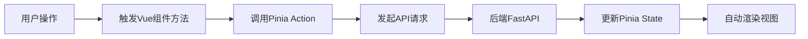

以下是 **Vue 前端项目** 的 `ARCHITECTURE.md` 文件编写指南，结合你的健身应用项目需求，提供清晰的结构和内容示例：

---

# **前端架构设计文档**
**项目名称**：健身应用前端  
**技术栈**：Vue 3 + Vite + Pinia + Axios

---

## **1. 项目结构概览**
```markdown
src/
├── assets/               # 静态资源（图片、字体等）
├── components/           # 通用组件
│   ├── ui/               # 基础UI组件（按钮、卡片等）
│   ├── charts/           # 图表组件
│   └── ...               
├── composables/          # 组合式函数（逻辑复用）
├── stores/               # Pinia 状态管理
├── router/               # 路由配置
├── styles/               # 全局样式
├── utils/                # 工具函数
├── views/                # 页面级组件
│   ├── auth/             # 登录/注册页
│   ├── dashboard/        # 用户主页
│   ├── challenges/       # 挑战功能页
│   └── ...               
├── App.vue               # 根组件
└── main.js               # 应用入口
```

---

## **2. 核心技术栈说明**
### **Vue 3 + Vite**
- **优势**：响应式开发、快速构建。
- **关键配置**：
  ```js
  // vite.config.js
  export default defineConfig({
    plugins: [vue()],
    server: { proxy: { '/api': 'http://localhost:8000' } } // 代理后端API
  })
  ```

### **Pinia 状态管理**
- **核心 Store 模块**：
  ```markdown
  stores/
  ├── auth.store.js       # 用户认证状态（token、用户信息）
  ├── training.store.js   # 训练记录和计划
  └── challenges.store.js # 挑战相关状态
  ```
- **示例代码**：
  ```javascript
  // stores/auth.store.js
  export const useAuthStore = defineStore('auth', {
    state: () => ({ user: null, token: null }),
    actions: {
      async login(username, password) {
        const res = await axios.post('/api/login', { username, password });
        this.user = res.data.user;
      }
    }
  });
  ```

### **路由设计 (Vue Router)**
- **路由配置**：
  ```javascript
  // router/index.js
  const routes = [
    { path: '/', component: Home },
    { path: '/login', component: Login, meta: { requiresGuest: true } },
    { path: '/challenges', component: Challenges, meta: { requiresAuth: true } }
  ];
  ```
- **导航守卫**：检查用户权限和登录状态。

---

## **3. 关键功能实现**
### **API 通信**
- **Axios 封装**：
  ```javascript
  // utils/api.js
  const api = axios.create({ baseURL: '/api' });
  api.interceptors.request.use((config) => {
    const token = useAuthStore().token;
    if (token) config.headers.Authorization = `Bearer ${token}`;
    return config;
  });
  ```
- **接口分类**：
    - `authApi.js`：登录/注册接口
    - `trainingApi.js`：训练记录相关接口

### **响应式设计**
- **移动端适配**：使用 `postcss-px-to-viewport` 插件实现视口单位转换。
- **CSS 方案**：Scoped CSS + Tailwind CSS（可选）。

---

## **4. 数据流管理**


---

## **5. 开发规范**
### **代码风格**
- **ESLint**：Airbnb 规则 + Vue 3 推荐配置。
- **提交规范**：Commitizen + `git-cz`。

### **组件设计原则**
1. **原子化**：小型、单一职责的组件。
2. **Props 验证**：
   ```javascript
   props: {
     activityType: { type: String, required: true },
     duration: { type: Number, default: 30 }
   }
   ```

---

## **6. 部署流程**
1. **构建**：`npm run build` → 生成 `dist/` 目录。
2. **托管**：Nginx 配置示例：
   ```nginx
   server {
     listen 80;
     location / {
       root /var/www/fitness-app;
       try_files $uri $uri/ /index.html; # 支持Vue Router History模式
     }
     location /api {
       proxy_pass http://backend:8000;
     }
   }
   ```

---

## **7. 扩展性设计**
- **插件化**：动态加载第三方库（如地图、图表）。
- **微前端**：未来可拆分子应用（如挑战模块独立部署）。

---

**附：截图示例**  
  
*（可替换为实际项目截图）*

---

### **为什么这样写？**
1. **清晰分层**：开发者能快速定位代码。
2. **技术栈透明**：新成员快速上手。
3. **维护友好**：记录关键设计决策。

根据你的项目实际结构调整内容，确保与代码保持一致！