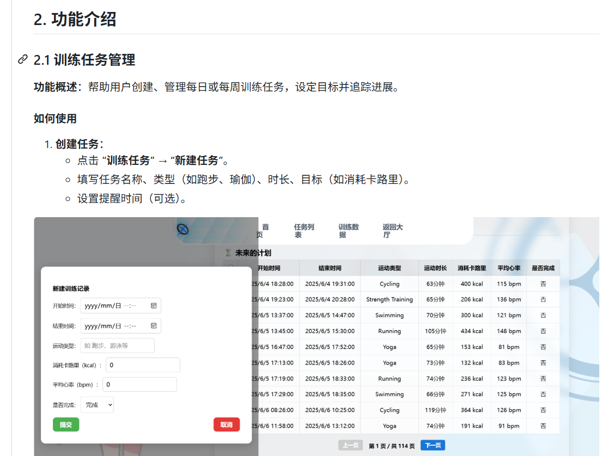
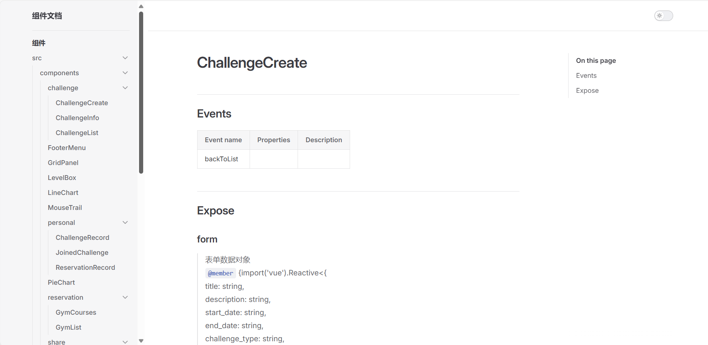
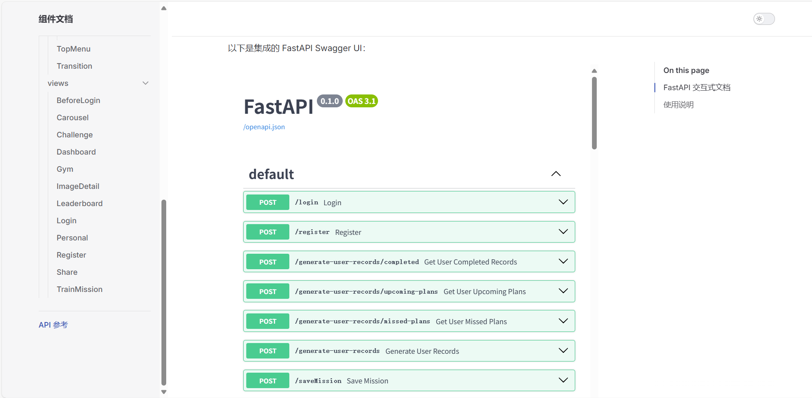
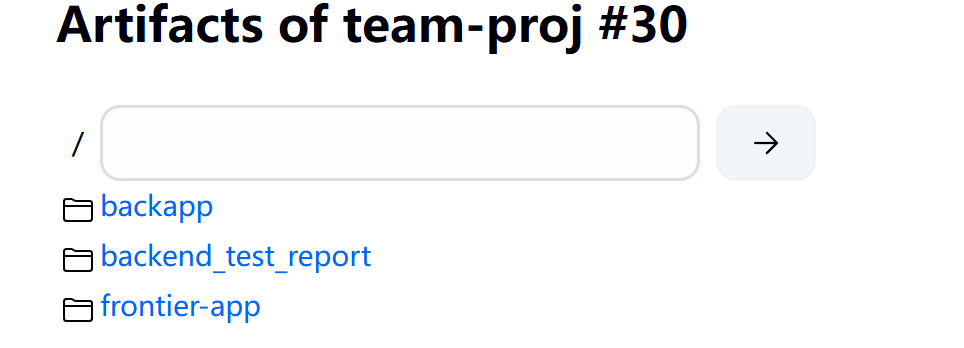
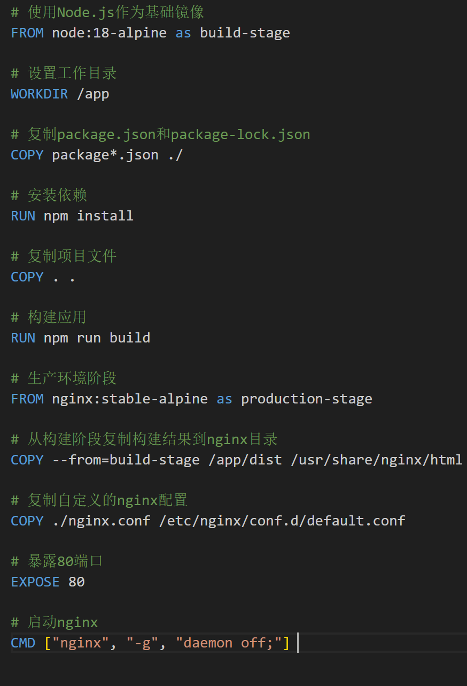
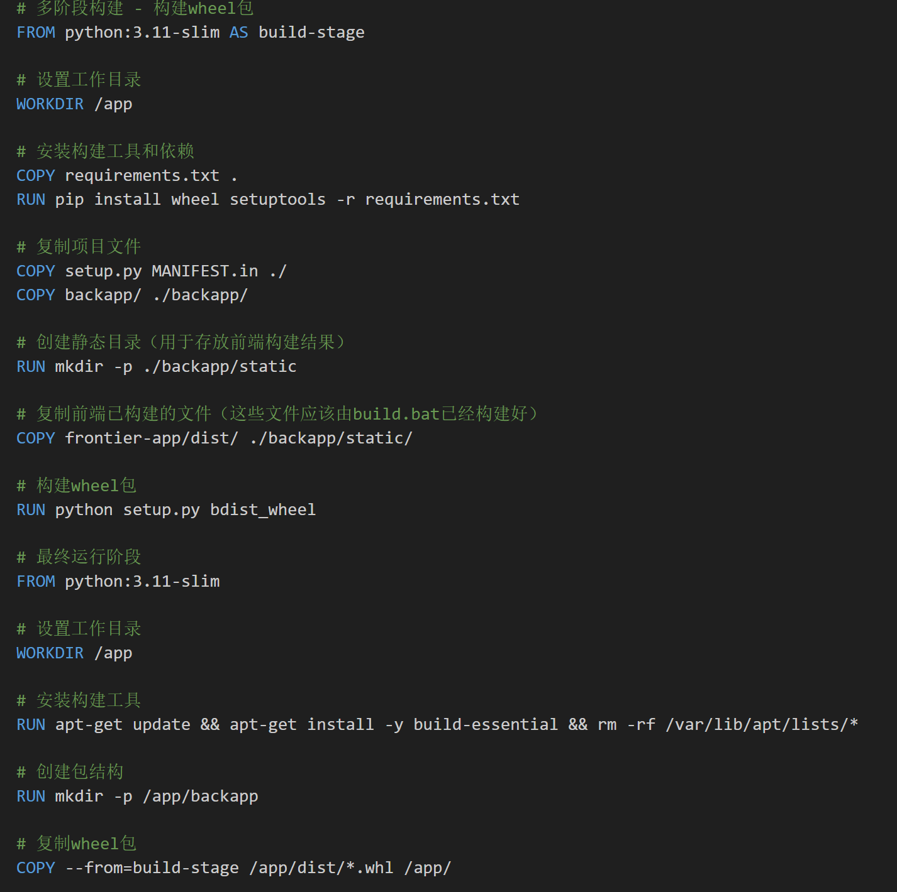
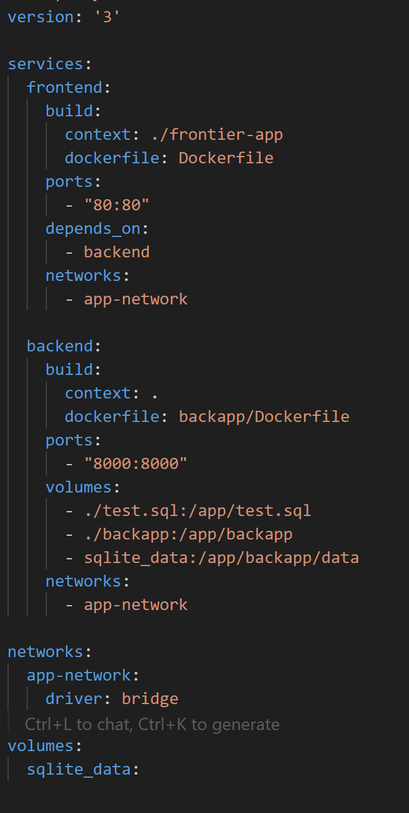
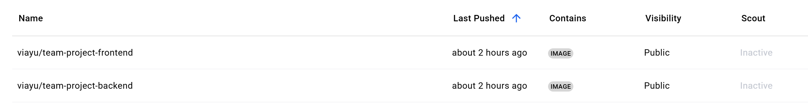

# final-report-59
## 1. Metrics

在本项目中，我们对软件的各项度量指标进行了统计与分析，以评估代码质量和工程结构的合理性。以下是所使用的度量指标及工具说明：

### 1.1 代码行数与源文件数量

- **指标说明**：用于评估项目规模，便于了解代码量与模块划分情况。

- **使用工具**：Cloc（Count Lines of Code）

- **命令示例**：

  ```bash
  cloc ./frontend
  cloc ./backend
  
  ```


### 1.2 圈复杂度（Cyclomatic Complexity）

- **指标说明**：圈复杂度反映代码的逻辑复杂程度，有助于识别潜在的高风险函数或模块。

- **使用工具**：

  - 前端：Plato（适用于 JavaScript/TypeScript 项目）
  - 后端：Radon（适用于 Python 项目）

- **命令示例**：

  ```
  bash复制编辑# 前端
  plato -r -d report/ ./src
  
  # 后端
  radon cc ./backend -a
  ```


### 1.3 依赖数量

- **指标说明**：统计项目所依赖的第三方库数量，可评估项目对外部组件的依赖程度。

- **使用工具**：

  - 前端：npm（通过 `package.json` 统计）
  - 后端：pipdeptree（基于 Python 虚拟环境）

- **命令示例**：

  ```
  bash复制编辑# 前端
  npm list --depth=0
  
  # 后端
  pipdeptree
  ```

通过上述度量工具和指标分析，我们能够更加系统地把握项目复杂度、依赖性和维护成本，为后续优化与重构提供数据支持。


  


## 2. Documentation

### 2.1 面向用户的文档

使用`Markdown`文档编写，为用户提供安装、配置和使用软件的详细指导，确保用户能够快速上手并有效使用软件功能。

#### **大纲内容**
- **快速入门指南**：
    - 本地安装和运行
    - 基础使用说明和示例
- **功能**：
    - 核心功能描述
- **常见问题与解决**：
    - 列出常见问题及其解决方案。

#### **文档展示**



#### **用户文档访问**
- **GitHub README.md**：[README链接](https://github.com/sustech-cs304/team-project-25spring-59/blob/main/README.md)

### 2.2 面向开发者的文档

帮助开发者理解软件的设计、架构和实现细节，便于后续维护、扩展或贡献代码。

#### **实现工具**
前端使用`vue-docgen-api`+`VitePress`自动提取组件信息并渲染生成静态网站，后端使用`Swagger`自动生成FastAPI文档页面

#### **大纲内容**
- **前端组件**：
    - 提供组件中使用的变量、方法等信息
- **后端API文档**：
    - 详细描述接口端点、请求/响应格式及认证方式。

#### **示例**





通过以上文档，确保最终用户和开发者能够高效地使用、维护和扩展软件。

---

## 前端单元测试以及E2E测试
为了保证前端应用的稳定性与可维护性，本项目在不同测试层级实施了以下测试策略：

### 2.1 单元测试（Unit Testing）

- **测试框架**：Vitest
- **说明**：Vitest 是一个快速、轻量的 Vite 原生单元测试框架，适用于 Vue、React 等现代前端框架。
- **测试范围**：组件逻辑、工具函数、状态管理逻辑等。
- **测试命令**：
  ```bash
  npm run test
配置说明：

所有测试文件以 .test.ts 或 .test.js 命名。

测试覆盖率支持 Istanbul 兼容报告，可通过 --coverage 参数生成。

示例命令：

bash
复制
编辑
vitest run --coverage


### 2.2 端到端测试（End-to-End Testing）
测试工具：Cypress

说明：Cypress 是一款现代化 E2E 测试工具，支持在浏览器中自动化模拟真实用户交互。

测试范围：从页面加载、表单交互、导航行为到后端 API 响应的完整流程。

测试命令：

bash
复制
编辑
# 启动测试 UI 界面
npx cypress open

# 或以无头模式运行测试
npx cypress run
配置说明：

所有测试脚本位于 cypress/e2e/ 目录下。

测试前需确保前端服务处于运行状态，或在 cypress.config.ts 中设置自动启动服务。


## 后端自动化测试报告

### 所用技术 / 工具 / 框架

本项目后端采用 **FastAPI** 开发，自动化测试部分使用了以下技术与工具：

- **pytest**：主要测试执行器和断言框架。
- **FastAPI TestClient（httpx）**：用于测试 API 接口。
- **pytest-cov**：用于统计测试覆盖率。
- **coverage.py**：生成终端和 HTML 格式的覆盖率报告。

------

###  测试源码与相关文件

- 测试目录位置：`/test`

- 主要测试文件包括：

  - `test_course.py`
  - `test_post.py`
  - `test_training.py`
  - `test_mission.py`
  - `test_login.py`

- 项目结构简要：

  ```
  bash复制编辑SE_pro/
  ├── backapp/         ← 后端源代码
  └── test/            ← 测试代码
  ```

- 测试执行命令如下：

  ```
  bash
  
  pytest --cov=backapp --cov-report=term-missing --cov-report=html
  ```

- 覆盖率报告截图位于 `htmlcov/index.html`，如下所示：

  


------

###  测试效果说明

我们通过 `pytest-cov` 工具获取了如下测试覆盖情况：

| 模块                   | 覆盖率  |
| ---------------------- | ------- |
| 后端总覆盖率           | **75%** |
| CRUD 模块              | 74%     |
| 模型定义（models）     | 98%     |
| 主 API 路由（main.py） | 74%     |


当前测试覆盖了大部分核心功能，包括：

- 用户训练记录的新增、更新、切换状态
- 动态与评论发布、点赞、获取
- 健身课程与健身房的预约与取消
- 用户基本信息与统计数据查询

------

### 测试覆盖率较低文件分析

| 文件名                         | 覆盖率 | 原因分析                                                     |
| ------------------------------ | ------ | ------------------------------------------------------------ |
| `backapp/setup.py`             | 0%     | 该文件仅用于初始化设置或数据填充脚本，属于部署辅助脚本，不属于运行期逻辑，因此未纳入自动化测试范围。 |
| `backapp/databases/init_db.py` | 39%    | 该模块负责数据库初始化和模拟数据填充，包含大量数据库写入逻辑，测试时会影响真实数据，因此未设置自动化测试，仅在开发阶段人工运行。 |

### 主要测试文件测试遗失分析

以main.py为例，像命令行中输出的遗失测试部分主要为以下内容

- 36-87 初始化数据库的部分，测试前本就需要启动数据库初始化，无需测试

  ```python
  @app.on_event("startup")
  def startup_db_client():
      init_db()
      # insert_mock_data()  # 👈 启动时自动插入数据
      # 执行 test.sql 文件
      from sqlalchemy import text
      from databases.database import SessionLocal
      
      try:
         ........
      
  ```

- 239， 244等 主要为raise错误，已包含在测试文件中

  ```
  raise HTTPException(status_code=401, detail="用户名或密码错误")
  ```

- 381-397等，对数据进行格式化返回

  ```python
   for record in records:
              record_dict = {
                  "id": record.id,
                  "user_id": record.user_id,
                  "start_time": record.start_time,
                  "end_time": record.end_time,
                  "activity_type": record.activity_type,
                  "duration_minutes": record.duration_minutes,
                  "is_completed": record.is_completed,
                  "record_type": record.record_type,
                  "reminder_time": record.reminder_time,
                  "distance": record.distance,
                  "calories": record.calories,
                  "average_heart_rate": record.average_heart_rate,
                  "max_heart_rate": record.max_heart_rate,
                  "minute_heart_rates": record.minute_heart_rates if record.minute_heart_rates else {}
              }
              result.append(record_dict)
  ```

### 测试方法示例与设计策略说明

为了保障健身预约系统的稳定性与核心业务逻辑的正确性，我们设计了多种类型的自动化测试。以下列举几个典型测试方法，说明我们的测试覆盖策略：

------

#### 1. **正常流程验证测试**（Happy Path）

```
python复制编辑def test_reserve_course_successfully():
    payload = {"user_id": 1, "course_id": 12}
    response = client.post("/gym/reserveCourse", json=payload)
    assert response.status_code == 200
```

✅ **测试目标：** 确保用户可以正常预约未满员的课程。该测试验证系统主业务流程是否顺畅，避免用户在正常情况下失败。

------

#### 2. **异常情况测试**（Negative Testing）

##### 2.1 重复预约拦截

```
python复制编辑def test_reserve_course_falied_alreadyReserved():
    payload = {"user_id": 1, "course_id": 1}
    response = client.post("/gym/reserveCourse", json=payload)
    assert response.status_code == 400
```

##### 2.2 人数已满失败

```
python复制编辑def test_reserve_course_failed_capcityOverflowed():
    payload = {"user_id": 1, "course_id": 6}
    response = client.post("/gym/reserveCourse", json=payload)
    assert response.status_code == 400
```

 **测试目标：** 模拟非法/重复请求与边界限制，如：重复预约、课程已满等，测试系统防御性与业务约束是否生效。

------

#### 3. **数据内容校验测试**

```
python复制编辑def test_get_gyms():
    response = client.get("/gym/getGyms")
    gyms = response.json()
    expected = [
        {"name": "动享健身中心", "openTime": "06:00:00-23:00:00", "address": "..."},
        ...
    ]
    for i in range(3):
        assert gyms[i]["name"] == expected[i]["name"]
```

✅**测试目标：** 验证接口返回的数据内容是否符合预期格式、字段是否正确，测试数据初始化是否生效。

### 总结

| 指标               | 数据                             |
| ------------------ | -------------------------------- |
| 自动化测试文件数量 | 超过 10 个                       |
| 总体覆盖率         | **75%**                          |
| 使用工具           | pytest, FastAPI, coverage, httpx |

## 4. Build

### **4.1 构建技术、工具、框架与方法**

*   **前端 (`frontier-app`)**:
    *   **Node.js 和 npm**: Node.js 作为 JavaScript 的运行时环境。npm 用于管理前端项目的依赖库，并执行构建脚本。
    *   **Vite**: 一个高性能的前端构建工具，用于编译 Vue.js 单文件组件、TypeScript/JavaScript 代码、CSS 等，并进行优化、打包，生成静态资源文件。
    *   **Vue.js**: 前端框架，项目的用户界面基于此构建。

*   **后端 (`backapp`)**:
    *   **Python 和 pip (Pip Installs Packages)**: Python 是后端服务的主要编程语言。pip 用于从 Python Package Index (PyPI) 安装项目所需的库。
    *   后端的“构建”主要集中在依赖安装和环境配置上，因为 Python 是解释型语言，不需要像编译型语言那样的显式编译步骤。
    
*   **构建脚本与自动化**:
    *   **批处理脚本 (`build.bat` ) (本地/Windows)**: 一个自定义的批处理脚本，自动化了本地环境下的构建步骤，包括前端编译、后端依赖安装和前后端产物整合。
    *   **Jenkins (`Jenkinsfile`)**: 用于持续集成（CI）。`Jenkinsfile` 中定义了构建阶段，自动化从代码检出到编译打包的流程。

*   **构建方法**:
    *   前端应用首先通过 Vite 独立编译成静态资源。后端则通过 pip 安装依赖。随后，前端的静态产物被整合到后端项目的静态文件目录中。

### **4.2 自动化构建执行的任务**

自动化构建（[`Jenkinsfile`](https://github.com/sustech-cs304/team-project-25spring-59/blob/main/Jenkinsfile)）流程主要执行以下任务：

*   **激活虚拟环境**
*   **Checkout** 
    *   从版本控制系统（如 Git）获取最新的源代码。
*   **Frontend Build**:
    1.  **依赖安装**: 执行 `npm install` (或 `npm ci` 在 CI 环境中)命令，根据[`package.json`](https://github.com/sustech-cs304/team-project-25spring-59/blob/main/frontier-app/package.json)下载并安装所有前端依赖。
    2.  **代码编译**: 执行 `npm run build` 命令，将 Vue.js 组件、JavaScript/TypeScript 代码和 CSS 等静态资源进行编译、代码分割、Tree Shaking、压缩和混淆。
*   **Backend Build**:
    *   执行 `pip install -r requirements.txt` 命令，安装所有在 [`requirements.txt`](https://github.com/sustech-cs304/team-project-25spring-59/blob/main/requirements.txt) 中声明的 Python 依赖包。
    *   将前端构建产物 (`frontier-app/dist/` 目录下的所有内容) 复制到后端项目指定的静态文件目录 (`backapp/static/`)
*   **Wheel Package Build**
    *   将整合后的前端后端、requirement等生成wheel包
*   **Test Report Generation**:
    *   使用 cloc 统计前端代码行数
    *   使用 Plato 分析圈复杂度
    *   使用 jq 统计依赖数量
    *   使用 pipdeptree 导出依赖结构
    *   生成前端测试和后端测试报告
*   **Generate Docs**
    *   生成用户文档和开发者文档
*   **Artifact Archiving**
    *   将所有的产物（test report、docs、wheel包）进行归档
*   **Deployment**
    *   将应用部署到相应端口上


### 4.3 成功构建的最终产物

*   **前端静态资源**:
    *   **位置**: [`frontier-app/dist/`](https://github.com/sustech-cs304/team-project-25spring-59/tree/frontier-app/dist)
    *   **内容**: 包含 HTML, CSS, JavaScript 文件以及图片等其他静态资源。这些文件经过了编译、压缩和优化，可以直接部署到任何静态 Web 服务器，或由后端应用提供服务。

*   **配置好的后端应用代码及依赖**:

    *   **位置**: `backapp/`
    *   **内容**: 包含所有后端 Python 源代码，并且其运行所需的依赖已通过 `pip install -r requirements.txt` 在虚拟环境中准备好

*   **整合后的应用结构**:
    *   **位置**: [`backapp/static/`](https://github.com/sustech-cs304/team-project-25spring-59/tree//main/backapp/static)
    *   包含前端的`dist/`目录的内容

*   **Jenkins的构建产物**

    *   包含所有的测试报告、wheel包、静态文件、document

    

### **4.4 构建文件/脚本**

以下是项目中用于定义和执行构建过程的关键文件和脚本：

* [`package.json`](https://github.com/sustech-cs304/team-project-25spring-59/blob/main/frontier-app/package.json):

  *   **用途**: 定义前端项目的构建命令。

*  [`requirements.txt`](https://github.com/sustech-cs304/team-project-25spring-59/blob/main/requirements.txt) 
  * **用途**: 列出后端 Python 项目运行所需的所有依赖包。

    

* [`Jenkinsfile`](https://github.com/sustech-cs304/team-project-25spring-59/blob/main/Jenkinsfile)

  *   **用途**: 定义 Jenkins CI 流水线中的构建步骤。

### 4.5 Jenkins成功运行的截图


---

## **5. Deployment - Containerization**

### **5.1 容器化技术、工具、框架与方法**

*   **Docker**:
    *   **核心技术**: Docker 是一个开源的应用容器引擎，允许开发者将应用及其依赖打包到一个轻量级、可移植的容器中
    *   **`Dockerfile`**: 每个需要容器化的服务（前端、后端，或整合后的应用）都有一个 `Dockerfile`。这是一个文本文件，包含了一系列指令，用于告诉 Docker 如何构建该服务的镜像。指令包括指定基础镜像、复制文件、运行命令（如安装依赖、设置环境变量）和定义容器启动命令。
*   **Docker Compose**:
    *   **工具**: Docker Compose 是一个用于定义和运行多容器 Docker 应用程序的工具。
    *   **`docker-compose.yml`**: 通过一个 YAML 文件 (`docker-compose.yml`) 来配置应用的服务、网络和卷。这使得开发者可以用一条命令 (`docker-compose up`) 启动、停止和管理整个应用栈（例如，前端容器、后端容器、数据库容器）。
*   **容器化方法**:
    *   前端和后端被构建为独立的 Docker 镜像，并通过 Docker Compose 进行编排。前端镜像包含一个 Web 服务器（Nginx）来服务静态文件，后端镜像包含应用服务器（Uvicorn）来运行 FastAPI 应用。

### **5.2 容器化脚本**

*   **前端的[`frontier-app/Dockerfile`](https://github.com/sustech-cs304/team-project-25spring-59/blob/main/frontier-app/Dockerfile)**:
    
    * **用途**: 部署前端
    
      
    
*   **后端的[`backapp/Dockerfile`](https://github.com/sustech-cs304/team-project-25spring-59/blob/main/backapp/Dockerfile)**:
    
    *   **用途**: 构建后端
    
*   **[nginx.conf](https://github.com/sustech-cs304/team-project-25spring-59/blob/main/frontier-app/nginx.conf) (Nginx 配置文件)**:
    
    *   **用途**: 配置 Nginx 服务前端SPA，确保路由正确。
    
*   **[docker-compose.yml](https://github.com/sustech-cs304/team-project-25spring-59/blob/main/docker-compose.yml)**:
    
    *   **用途**: 定义和编排多容器应用（前端、后端、数据库）。
    
    
    
    

### **5.3 成功容器化**

1.  **`docker images` 命令显示新构建的镜像**:
    执行 `docker ps` 命令,查看正在运行中的容器，前端和后端正常运行。
2.  **应用可访问和功能正常**:
    *   **前端**: 在浏览器中访问为前端服务映射的主机端口（ `http://localhost:80`），能看到应用界面并能与之交互。
    *   **后端**: 后端 API 端点能通过映射的端口（例如 `http://localhost:8000`）被访问，并且前端发起的 API 请求能得到正确响应。
3.  **上传到 docker hub 上**

