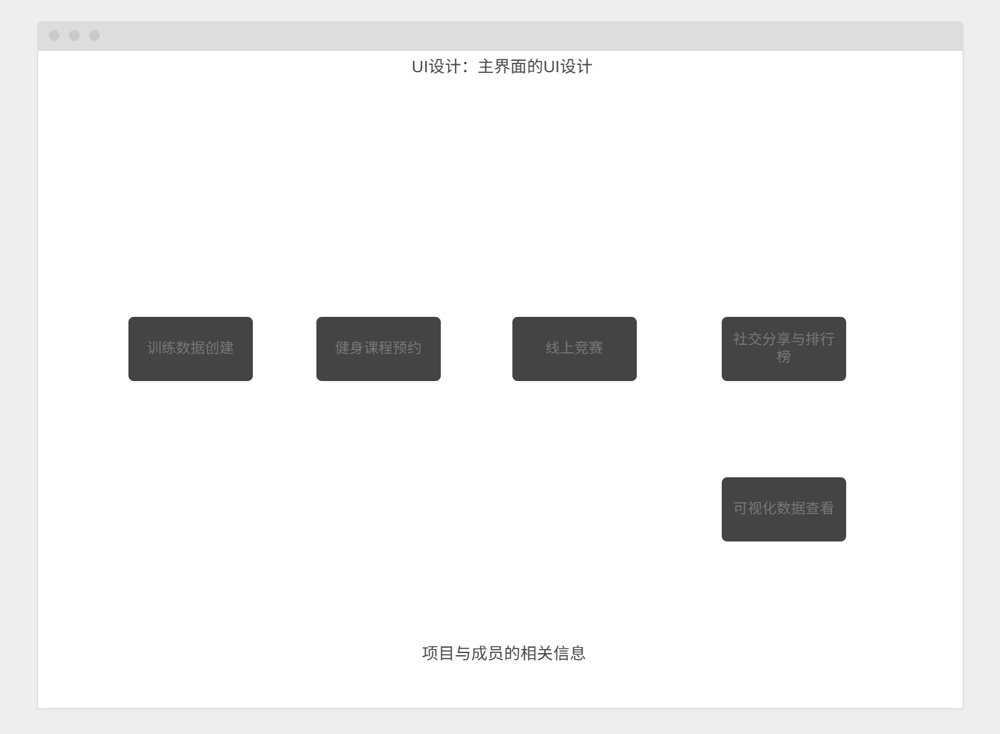
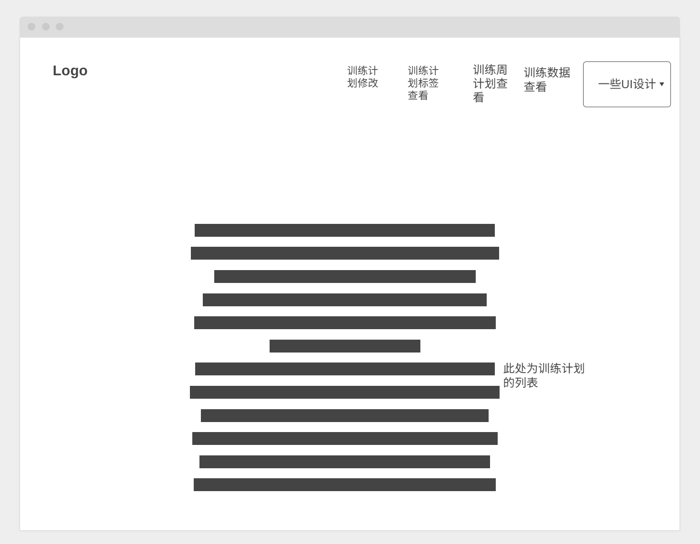
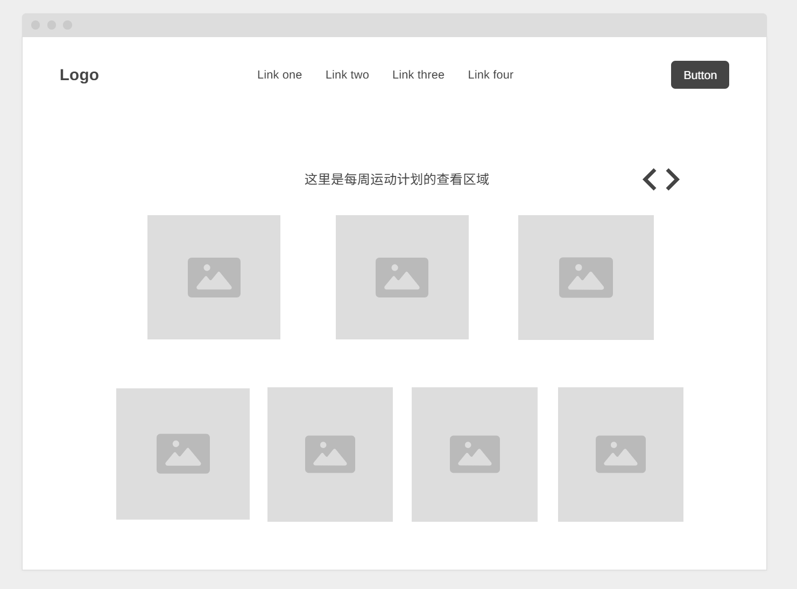
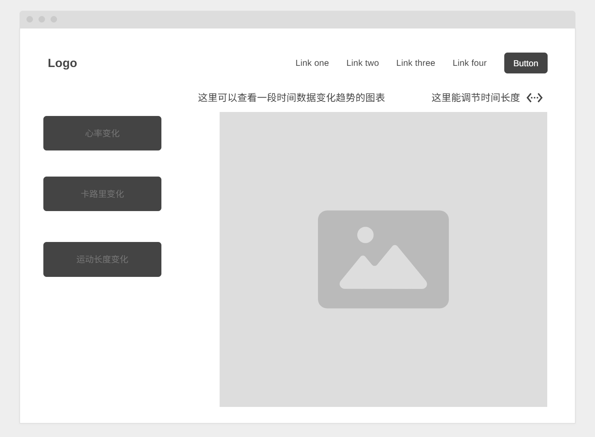
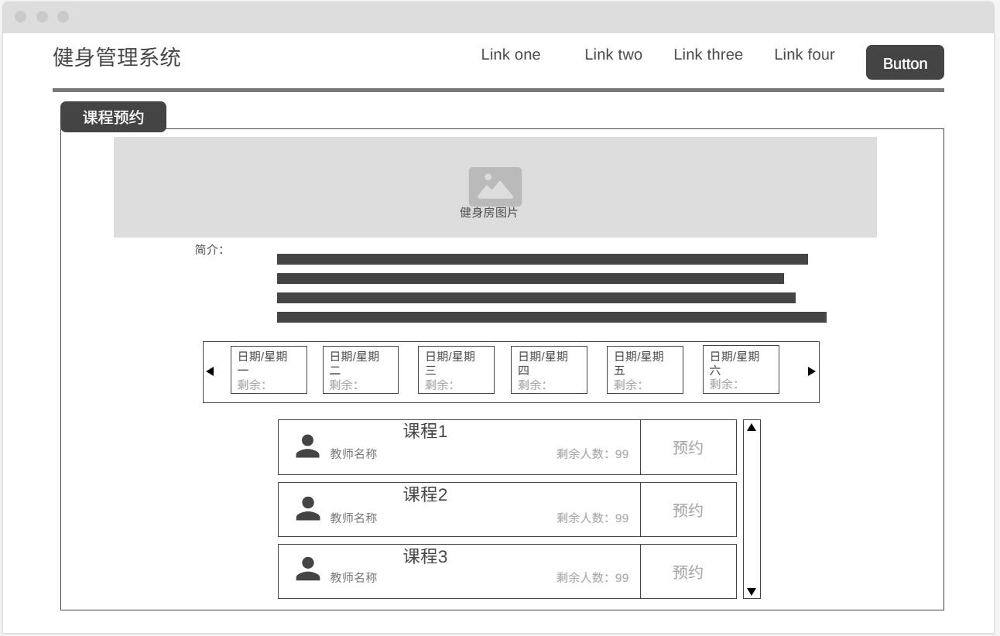
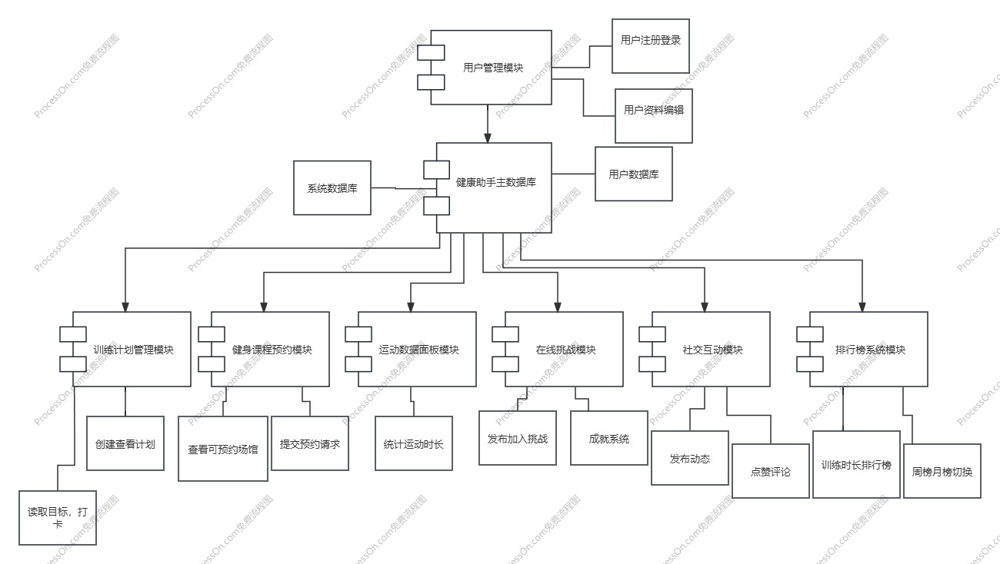

# 软件工程Spring2 设计文档

Group2小组成员： 笃岳霖，石岩松，王天瑞，舒飏，赵欣瞳

## 一、UI设计

​	首先，我们在这个项目中主要计划实现5个功能，分别为训练计划管理，健身课程预约，社交与分享，线上竞技以及训练数据的可视化查看。我们主要[...]

#### 主界面UI：

#### 训练计划管理：

#### 每周训练计划界面：

#### 训练数据可视化界面：

#### 健身课程预约界面：

## 二、软件架构设计

#### 设计原则：

模块解耦、职责分明：每个功能点均以单独模块实现，便于开发与测试。

以数据库为中心的数据共享模式：主数据库统一存储所有核心数据，供各功能模块共享访问。

接口标准化：模块间交互通过标准 FAST API 实现，提高模块替换与扩展灵活性。

#### 隐含设计假设：

所有模块共享一套用户体系，权限控制基于登录状态；

所有模块可通过 FAST API 独立部署和调试；

训练数据和用户打卡行为是中心数据，驱动大部分统计/排行榜逻辑；
